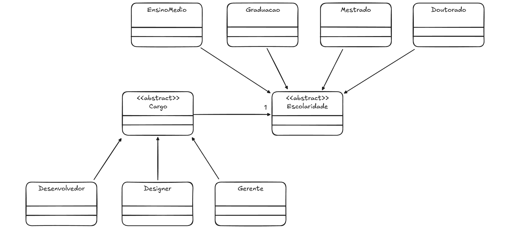

# Padrão Bridge aplicado a um sistema de cargos e salários

## 📌 Descrição
Este projeto implementa o padrão **Bridge** para separar as responsabilidades de **Cargos** e **Escolaridade**.

O **padrão Bridge** permite desacoplar a abstração (Cargos) da implementação (Escolaridade), possibilitando a extensão independente de ambas.

## 🎯 Como o Bridge foi aplicado?
- Foi criada a interface EducationLevel, que define o método percentualAumento().
- Foi implementada a interface EducationLevel em diferentes classes (EnsinoMedio, Graduacao, Mestrado, Doutorado).
- A classe Cargo recebe um EducationLevel, permitindo que cargos como Desenvolvedor, Designer e Gerente tenham comportamentos diferentes de acordo com o nível educacional do funcionário.

## Aluno
- Nome: João Vitor Amorim Lopes
- Matrícula: 0900043180
- Curso: Sistemas de Informação
